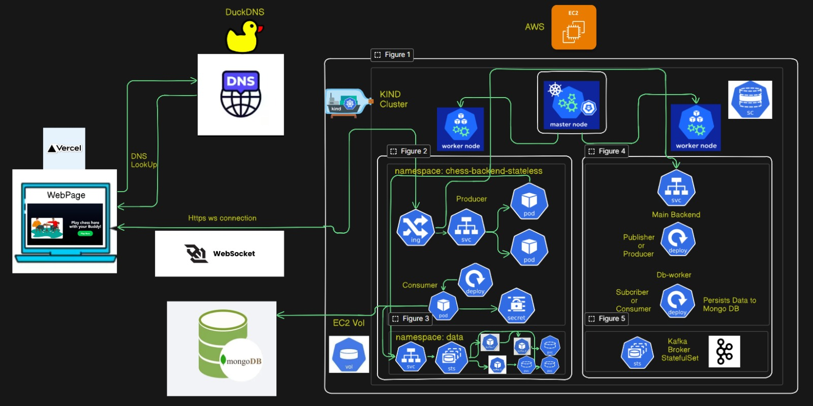

#     
# ChessWithBuddy
### *A real-time multiplayer chess platform that lets you play chess with your friends, featuring low-latency gameplay and persisting the data without hindering the gameplay.*

[](#)
[](https://opensource.org/licenses/MIT)
[](#)
[](#)

## 🎨 Preview

! Home Page - Create or Join a Game
! In-Game Chess Board
! Checkmate & Game Over

## 🏗 Architecture 



The application follows a distributed, highly scalable architecture:
1. **Frontend**: A React web application that connects to the backend network via WebSockets for real-time multiplayer functionality.
2. **Backend**: A Node.js server using WebSockets (`ws`) to manage game state with `chess.js`, handle matchmaking, and publish game moves and state changes to a Kafka topic.
3. **Message Broker**: Apache Kafka is used to queue all incoming moves quickly without the delay of uploading the moves to mongodb atlas asynchronously, ensuring smooth real time game play.
4. **DB Worker**: An independent Node.js worker service that continuously consumes messages from the Kafka topics and reliably persists the moves and game records into MongoDB.

## 🛠 Tech Stack

* **Backend:** Node.js, WebSockets (`ws`), `chess.js`
* **Worker Service:** Node.js, KafkaJS, Mongoose
* **Database:** MongoDB
* **Message Broker:** Apache Kafka
* **Infrastructure:** Kubernetes, Docker, AWS (EC2), GitHub Actions for CI/CD
* **Frontend:** React, TailwindCSS, Vite

## 🚀 Deploying the Backend on a Fresh EC2 Instance
This project relies on Kubernetes to orchestrate the backend services (WebSocket server, Kafka, message consumer, and MongoDB). 

If you are setting this up on a fresh Ubuntu EC2 instance, follow these exact steps to install dependencies, initialize your cluster via `kind`, and deploy all necessary services.

**Step 1: Install Dependencies (Docker, `kubectl`, `kind`)**
```bash
# Install Docker
sudo apt-get update && sudo apt-get install -y docker.io
sudo usermod -aG docker $USER && newgrp docker

# Install kubectl
curl -LO "https://dl.k8s.io/release/$(curl -L -s https://dl.k8s.io/release/stable.txt)/bin/linux/amd64/kubectl"
sudo install -o root -g root -m 0755 kubectl /usr/local/bin/kubectl

# Install kind
[ $(uname -m) = x86_64 ] && curl -Lo ./kind https://kind.sigs.k8s.io/dl/v0.20.0/kind-linux-amd64
chmod +x ./kind && sudo mv ./kind /usr/local/bin/kind
```

**Step 2: Create the Kubernetes Cluster**
Use the provided `config.yml` configuration file to create a `kind` cluster with Ingress support enabled:
```bash
kind create cluster --config k8s/config.yml
```

**Step 3: Setup the Ingress Controller**
Install the NGINX Ingress controller so your cluster can accept incoming web traffic:
```bash
kubectl apply -f https://raw.githubusercontent.com/kubernetes/ingress-nginx/main/deploy/static/provider/kind/deploy.yaml

# Wait for the ingress controller to be ready chesk by using thi command
kubectl get all -n ingress-nginx
```

**Step 4: Install Cert-Manager**
Since the application uses a `ClusterIssuer` to handle TLS certificates automatically, you need to install `cert-manager` first before the application configuration:

```bash
kubectl apply -f https://github.com/cert-manager/cert-manager/releases/download/v1.16.1/cert-manager.yaml

# Wait for cert-manager to be ready
kubectl get pods -n cert-manager
```

**Step 5: Deploy the Application Infrastructure**
Now, you can sequentially deploy your actual application resources:

```bash
# 1. Apply the namespace first
kubectl apply -f k8s/namespace.yml

# 2. Apply secrets and persistent volume concepts (assuming db-secrets.yml was provided)
kubectl apply -f k8s/db-secrets.yml

# 3. Deploy Kafka (StatefulSet and Service)
kubectl apply -f k8s/kafka-service.yml
kubectl apply -f k8s/kafka-statefulset.yml

# Wait for Kafka pods to be ready (optional but recommended)
kubectl get pods -n statless

# 4. Deploy the Backend and DB-Worker Services
kubectl apply -f k8s/backend-service.yml
kubectl apply -f k8s/backend-deployment.yml
kubectl apply -f k8s/db-worker-deployment.yml

# 5. Set up networking and SSL (Ingress and ClusterIssuer)
kubectl apply -f k8s/cluster-issuer.yml
kubectl apply -f k8s/backend-ingress.yml
```

**Step 6: Verify the Deployment**
Once all the configuration files are applied, verify that the pods are running correctly in the `chess-backend-stateless` namespace:

```bash
kubectl get all -n chess-backend-stateless
kubectl get secrets -n chess-backend-stateless
kubectl get all -n data
kubectl get pvc -n data

```

Your backend WebSocket service should now be live and ready to accept connections from the React frontend in vercel!
